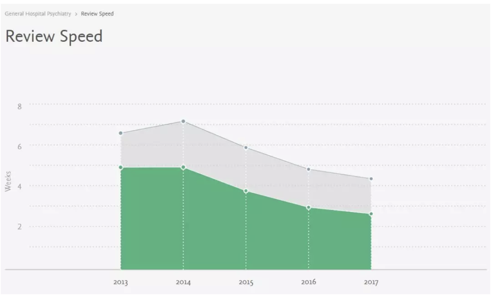
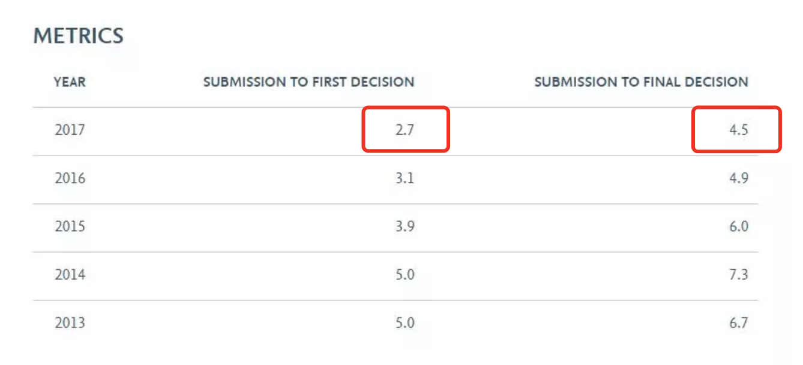

## Puppeteer采集SCI期刊数据

#### 1. 学习目标

- 学习和使用基于`Nodejs/Puppeteer`的网页爬虫技术。
- 利用`Puppeteer`爬取Elsevier官网关于期刊**审稿速度**和**接受率**两个重要参数。
- 利用`mongoose`将数据实时保存至本地的mongoDB数据库。

#### 2. 运行程序

爬取“审稿速度”数据：

```
node review_speed.js
```

爬取“接受率”数据：

```
node acceptance_rate.js
```

#### 3. 采集原理

Elsevier官方提供了旗下期刊的 **Review Speed** 和 **Acceptance Rate** 指标，通过使用不同期刊的ISSN号来构造URL，抓取相关数据。例如：

> [https://journalinsights.elsevier.com/journals/0163-8343/review_speed](https://journalinsights.elsevier.com/journals/0163-8343/review_speed)





> 待采集列表中的ISSN为所有Elsevier旗下的SCI期刊，数据来源于[Clarivate](http://mjl.clarivate.com/cgi-bin/jrnlst/jlresults.cgi?PC=D)并经过整理，但要注意并不是每本期刊都有我们想要采集的两项数据指标。

#### 4. Puppeteer的基本使用

基于`Node.js/Puppeteer无头浏览器`的爬虫技术为前端人员提供了高效数据采集的手段，相比使用`Python`数据采集的方式，其上手更简单，适合用于比较简单的采集任务。初步使用方法可参考：

- [Puppeteer 与 Chrome Headless —— 从入门到爬虫](https://juejin.im/entry/59ad6c4f5188250f4850dccc)

- [无头浏览器 Puppeteer 初探](https://juejin.im/post/59e5a86c51882578bf185dba)


#### 5. 成果转化

根据数据采集结果整理发布微信图文，扫描二维码预览。

